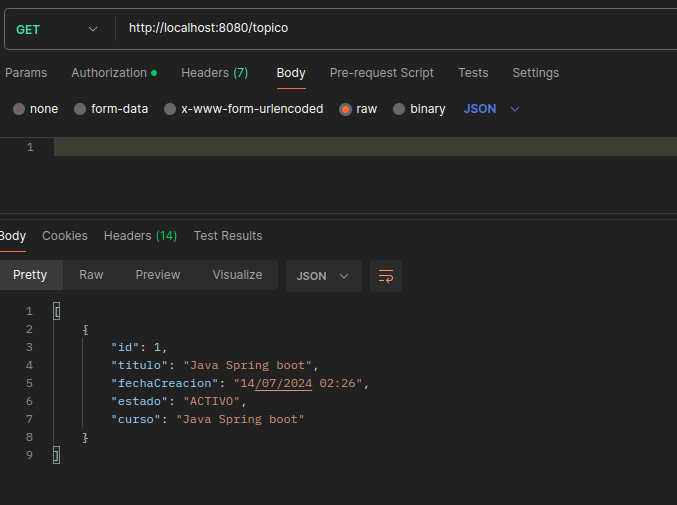
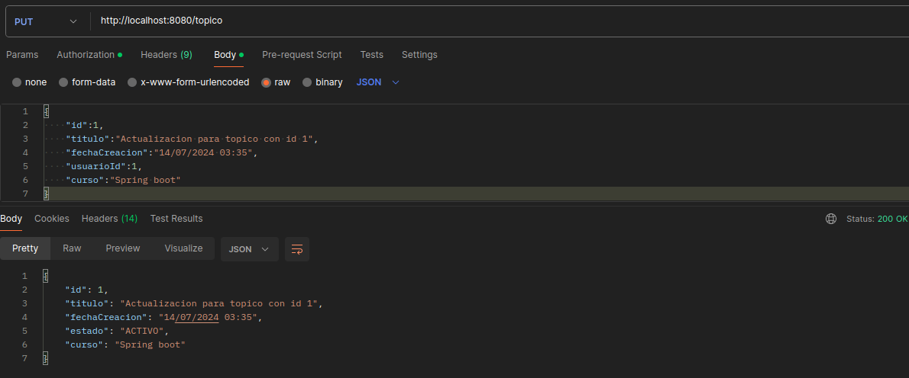

# FOROHUB  
Esta es una api que permite crear, visualizar, actualizar y eliminar un topico asociado a un usuario  
Para que estas operaciones esten disponibles, el usuario debe estar logeado en la base de datos.  

### BASE DE DATOS  
- La configuracion de la base de datos se hizo a través de Docker Compose. Usted puede visualizar el archivo  
`docker-compose.yml`. Además se crea automaticamente la base de datos.
- Para levantar la base de datos, debe tener instalado docker y docker compose  
- Luego con el comando `docker-compose up` la base de datos comenzara a crearse
- Con el comando `docker ps` puede verificar los contenedores activos actuales  

### ENTIDADES
1. Usuario  
Cuenta con los siguientes atributos:
    - id: Integer
    - correo: String
    - contrasena: String
2. Topico  
Cuenta con los siguientes atributos:
    - id: Integer
    - titulo: String
    - fechaCreacion: LocalDateTime, formato "dd/MM/yyyy HH:mm"
    - Estado: ENUM(ACTIVO, INACTIVO)
    - autor: Usuario
    - curso: String

### ENDPOINTS
- `GET: /topico`, permite listar los topicos que hay en la base de datos
- `GET: /topico/id`, permite encontrar un topico por ID
- `POST: /topico`, permite crear un nuevo topico, los atributos a enviar son: "titulo":String, "fechaCreacion":String con formato dd/MM/yyyy HH:mm, "usuarioId":Integer, "curso":String
- `PUT: /topico`, permite actualizar un topico, los atributos actualizables son: "titulo":String, "fechaCreacion":String con formato dd/MM/yyyy HH:mm, "usuarioId":Integer, "curso":String  
Adicionalmente debe enviar "id":Integer, para escpecificar el identificador del topico que desea actualizar
- `DELETE /topico/id`, permite eliminar un topico a partir de su Id o identificador
- `POST /login`, recibe las credenciales del usuario: "correo":String, "contrasena":String  
Devuelve token para usarse en los endpoints  

### AUTENTICACION Y AUTORIZACION
Aclarar que para usar los metodos es importante que primero registre un usuario en la base de datos de la siguiente manera  
  
La contraseña Hasheada ha sido `123456`

### DEMOSTRACION
1. Listando topicos sin enviar token

Respuesta

2. Generando token

Token devuelto

3. Listar topicos usando el token creado

4. Crear topico usando el token generado

5. Visualizar topico por Id uasndo el token generado

6. Actualizar un topico

7. Eliminar un topico

### GESTION DE ERRORES
1. En caso intente eliminar un topico que no existe en la base de datos

2. En caso intente ver un topico con id inexistente

3. En caso envie un topico con atributos incompletos para ser creado

